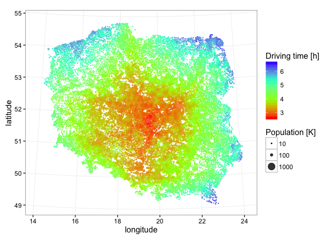

# Driving times between Polish cities

### Goal

Answer questions about driving time and distance between Polish cities.
Main question: What is the average driving time/distance from one city to reach a person in any city.

### Statistics


Each dot is a city and color indicates average driving time from this city to a random person in any other city in the country. This calculation does not cover villages.

Longest driving time between 2 cities

       start       |  destination  |    km   |    h
    Ustrzyki Dolne |   Kołobrzeg   | 1013.51 | 11.318

Shortest way between 2 cities

         start    | destination |   m    |   s
    Podkowa Leśna |   Brwinów   | 2772.8 | 252.8

City with shortest average driving time to other cities

      name  |   h   |    km     
    Stryków | 2.596 | 244.384
 
City with longest average driving time to other cities

         name      |   h   |    km     
    Ustrzyki Dolne | 6.347 | 508.290

`examples.sql` contains queries used to generate this statistics and more.
 
### Getting Started

#### Database

* Install PostgreSQL if you don't have it already.
* Import schema from `poland_schema.sql` to your database.
* Configure connection in `js/config.js` and in `R/db.R`.

#### Data

* Download XLS files from this sites:
  * [Population](http://stat.gov.pl/obszary-tematyczne/ludnosc/ludnosc/powierzchnia-i-ludnosc-w-przekroju-terytorialnym-w-2016-r-,7,13.html) link _Powierzchnia i ludność w przekroju terytorialnym w 2016 r. - tablice_
  * [Geolocation](http://www.codgik.gov.pl/index.php/darmowe-dane/prng.html) link _PRNG - nazwy miejscowości_

* Convert them to CSV.
* Run `prepare-cities.R` with working directory pointing the converted files.

#### Routing server

* Build [OSRM](https://github.com/Project-OSRM/osrm-backend).
* Download [map of Poland](http://download.geofabrik.de/europe/poland-latest.osm.pbf). Mirrors with [other maps](http://wiki.openstreetmap.org/wiki/Planet.osm).
* Set host of the server in `js/config.js`.

#### Running

Set number of cities you want to calculate. There is 919 cities and calculations for all of them take almost 2h. Cities with largest populations are taken first. The computational complexity is O(n<sup>2</sup>)

Run calculation.
```shell
$ npm install
$ npm run build && npm run serve
```

#### Results

Run `show-country-map.R` to see resulting times as colors on a map. You may run it also during calculation to see partial results.